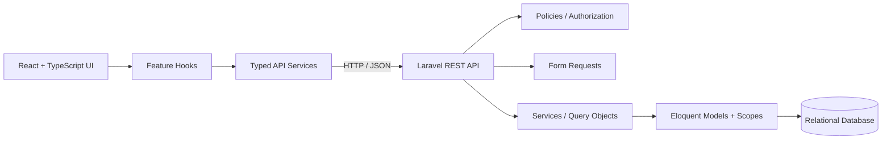
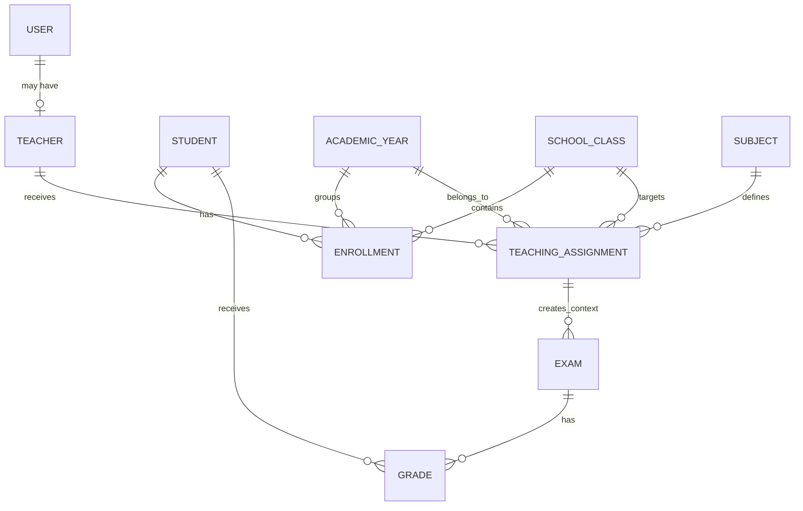
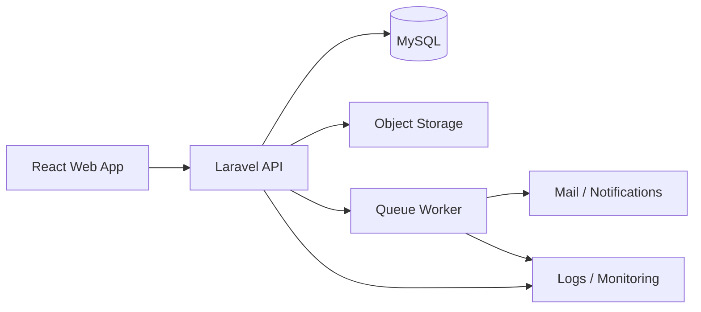
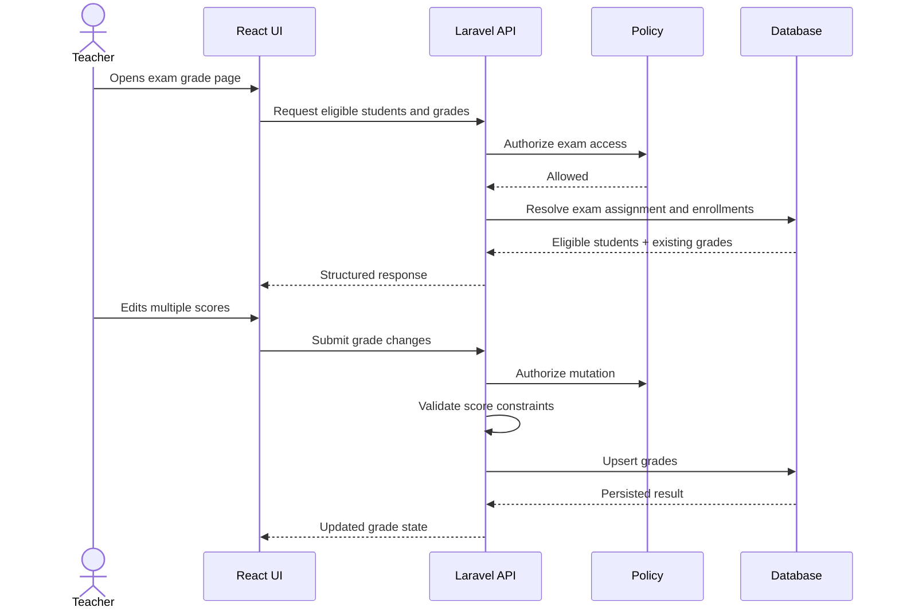

# Seven School — School Management Platform

> A full-stack school management application built with Laravel, React, and TypeScript to model real academic workflows for administrators and teachers.

> **Demo notice:** this repository is a portfolio / prototype project. Student names, grades, academic records, and other seeded data are fictional and exist only for development and demonstration purposes.

---

## Quick Navigation

- [Overview](#overview)
- [Why this project exists](#why-this-project-exists)
- [Current feature set](#current-feature-set)
  - [Authentication and authorization](#authentication-and-authorization)
  - [Student management](#student-management)
  - [Enrollment management](#enrollment-management)
  - [Exam management](#exam-management)
  - [Grade management](#grade-management)
  - [Statistics dashboard](#statistics-dashboard)
- [Technology stack](#technology-stack)
- [High-level architecture](#high-level-architecture)
- [Backend design](#backend-design)
- [Frontend architecture](#frontend-architecture)
- [Domain model](#domain-model)
- [Grade-management workflow](#grade-management-workflow)
- [Statistics design](#statistics-design)
- [Security and data integrity](#security-and-data-integrity)
- [Testing strategy](#testing-strategy)
- [Continuous integration](#continuous-integration)
- [API overview](#api-overview)
- [Project structure](#project-structure)
- [Installation](#installation)
- [Backend setup](#backend-setup)
- [Frontend setup](#frontend-setup)
- [Useful commands](#useful-commands)
- [Demo behavior](#demo-behavior)
- [Engineering decisions](#engineering-decisions)
- [Current limitations](#current-limitations)
- [Roadmap](#roadmap)
- [Possible future architecture](#possible-future-architecture)
- [Example use case](#example-use-case)
- [What I would improve next](#what-i-would-improve-next)
- [Author](#author)
- [License / usage](#license--usage)

---

## Overview

Seven School is a full-stack academic management platform focused on practical school operations rather than isolated CRUD screens.

The current application supports two authenticated roles:

- **Administrator** — manages students, enrollments, exams, and school-wide statistics.
- **Teacher** — works only with the students, subjects, classes, exams, grades, and statistics that belong to their teaching assignments.

The backend is the source of truth for validation, authorization, business rules, and data scoping. The React frontend consumes the API through typed services and feature-oriented hooks, and adapts the interface to the authenticated role.

The project is intentionally structured as an evolving production-style prototype: the current scope is usable, while the architecture leaves room for student-facing features, communication tools, learning resources, cloud storage, richer reporting, and other academic workflows.

---

## Why this project exists

School-management software quickly becomes more complex than basic CRUD because most actions depend on relationships:

- a student belongs to a class through an enrollment;
- an enrollment belongs to an academic year;
- a teacher teaches a subject to a class through a teaching assignment;
- an exam belongs to a teaching assignment;
- a grade belongs to both a student and an exam;
- statistics must respect the same academic and authorization boundaries.

This project was built to explore those constraints directly and to keep them explicit in the codebase.

---

## Current feature set

### Authentication and authorization

- Laravel Sanctum authentication.
- Login and logout flows.
- Role-aware frontend navigation.
- Laravel Policies for resource authorization.
- Teacher-scoped data access.
- Backend authorization as the security boundary.
- Frontend permission helpers used only for presentation and UX.

### Student management

- Student list.
- Student details.
- Create, update, and delete flows for administrators.
- Enrollment history.
- Current enrollment information.
- Enrollment count.
- Teacher-scoped student access.
- Server-driven data preserved when local mutations update the UI.

### Enrollment management

- Student enrollment management.
- Academic-year and school-class association.
- Validation of enrollment data.
- Admin-only enrollment mutations.
- Enrollment history.
- Pagination-aware list refresh after mutations.

### Exam management

- Exam listing.
- Server-side pagination.
- Filtering by academic year, class, and subject.
- Sorting.
- URL-based persistence of filters, pagination, and sorting.
- Create, edit, delete, and details flows.
- Teacher-scoped exam access.
- Teaching-assignment validation.
- Protection against deleting exams that already contain grades.

### Grade management

Teachers can manage grades only for students eligible for the selected exam.

The workflow supports:

- displaying all eligible students for an exam;
- displaying existing grades;
- representing ungraded students without creating empty grade rows;
- bulk grade creation and update;
- comments;
- grade deletion;
- maximum-score validation;
- graded and ungraded counts;
- one grade per student per exam.

### Statistics dashboard

The statistics module is available to both administrators and teachers, with backend scoping applied automatically.

Current dashboard capabilities include:

- filter options based on the authenticated user's accessible academic data;
- academic-year filtering;
- optional class filtering;
- subject-level overview;
- total student count;
- graded-record count;
- global normalized average;
- subjects passing / failing summary;
- subject-level pass / fail data;
- pass-rate visualization;
- top students for a selected subject;
- responsive dashboard UI;
- loading, error, and empty states.

The frontend does not recalculate academic statistics. It renders values returned by the API.

---

## Technology stack

### Backend

- PHP 8.4+
- Laravel
- Laravel Sanctum
- Eloquent ORM
- Form Requests
- API Resources
- Policies
- Query / service classes for reporting logic
- PHPUnit / Laravel Feature Tests
- Laravel Pint
- Faker
- Mockery

### Frontend

- React 19
- TypeScript
- Vite
- React Router
- React Hook Form
- Zod
- Material UI
- Axios
- ESLint

### Delivery and tooling

- Git / GitHub
- GitHub Actions backend CI
- SQLite in CI
- MySQL for normal local development
- Conventional commits used across the project

---

## High-level architecture



The main architectural principle is simple:

> **The frontend coordinates interaction; the backend owns business rules.**

---

## Backend design

The backend is intentionally split by responsibility.

```text
Route
  ↓
Form Request
  ↓
Controller
  ↓
Service / Query Object
  ↓
Eloquent Models / Scopes
  ↓
API Resource
```

### Form Requests

Used for:

- input validation;
- request-level authorization when appropriate;
- keeping controllers small.

### Policies

Used for resource authorization and ownership rules.

Examples:

- a teacher cannot manage another teacher's exam;
- a teacher cannot grade students outside the exam context;
- administrators can access school-wide data allowed by the application scope.

### Services

Used when orchestration no longer belongs cleanly in a controller.

The statistics feature follows this style:

```text
StatisticController
    ↓
StatisticsService
    ↓
StatisticsQuery
    ↓
Eloquent / SQL aggregation
```

### Query objects

Complex reporting queries are kept outside controllers so joins, grouping, aggregate expressions, and reusable filtering rules remain testable and readable.

### API Resources

Resources define response shape and prevent controllers from becoming presentation layers.

### Database constraints

Important invariants are enforced at database level where possible.

For example:

```text
student_id + exam_id
```

is unique for grades.

This prevents duplicate grades even if application-level validation is bypassed.

---

## Frontend architecture

The React application follows a feature-oriented structure.

```text
feature/
├── components/
├── hooks/
├── pages/
├── services/
└── types/
```

Typical flow:

```text
Page
  ↓
Custom Hook
  ↓
Service
  ↓
Laravel API
```

This keeps HTTP details out of UI components and keeps page components focused on composition.

### Example: statistics feature

```text
statistics/
├── components/
│   ├── StatisticsFilter.tsx
│   ├── StatisticsTable.tsx
│   ├── SummaryCard.tsx
│   └── TopStudents.tsx
├── hooks/
│   ├── useStatistics.ts
│   └── useStatisticsFilterOption.ts
├── pages/
│   └── StatisticsPage.tsx
├── services/
│   └── statisticsService.ts
└── types/
    └── index.ts
```

### Typed API contracts

API responses and query parameters are modeled with TypeScript types rather than passed through the UI as unstructured objects.

Examples include:

- statistics filter options;
- statistics overview;
- top-student summaries;
- exam filters;
- student and enrollment models.

### Request cancellation

Data-fetching hooks use `AbortController` for requests that can become stale when filters change quickly.

This prevents an older response from overwriting newer UI state.

### UI state

The frontend explicitly handles:

- loading;
- error;
- empty;
- success;
- selected filters;
- URL-backed list state where navigation persistence matters.

---

## Domain model

The core academic relationships can be summarized as:



This relationship graph explains why reporting queries naturally involve multiple joins. Those joins are not accidental complexity; they reflect the domain.

---

## Grade-management workflow

An exam belongs to a teaching assignment:

```text
Exam
  ↓
Teaching Assignment
  ├── Teacher
  ├── Subject
  ├── School Class
  └── Academic Year
```

Eligible students are resolved through enrollment:

```text
Exam
  ↓
Teaching Assignment
  ↓
Class + Academic Year
  ↓
Enrollments
  ↓
Students
```

Grades are then matched by:

```text
exam_id + student_id
```

The API can therefore return the full eligible class, including students who do not yet have a grade.

Example shape:

```json
{
  "id": 2148,
  "full_name": "Student Name",
  "grade": {
    "id": null,
    "score": null,
    "comment": null,
    "graded_at": null
  }
}
```

This allows the UI to show ungraded students without creating placeholder database records.

---

## Statistics design

Statistics are normalized to percentages so exams with different maximum scores can be compared consistently.

Conceptually:

```text
normalized score = score × 100 / maximum_score
```

The reporting layer aggregates these normalized values by academic scope.

### Statistics API

| Method | Endpoint                                          | Purpose                                                                               |
| ------ | ------------------------------------------------- | ------------------------------------------------------------------------------------- |
| `GET`  | `/api/statistics/filter-options`                  | Returns the academic years, classes, and subjects available to the authenticated user |
| `GET`  | `/api/statistics/overview`                        | Returns dashboard summary metrics and per-subject performance                         |
| `GET`  | `/api/statistics/subjects/{subject}/top-students` | Returns the highest-performing students for one subject                               |

### Statistics authorization behavior

**Administrator**

Receives data for the authorized school scope.

**Teacher**

Receives only data connected to their teaching assignments.

The frontend does not duplicate this authorization logic.

### Dashboard response responsibilities

The backend calculates:

- student count;
- graded records;
- normalized averages;
- pass and fail counts;
- pass rates;
- subject-level performance;
- top students.

The frontend is responsible only for presenting those values.

---

## Security and data integrity

Security decisions live on the server.

Current rules include:

- teachers cannot manage exams belonging to other teachers;
- teachers can only manage grades for exams assigned to them;
- students outside an exam's class and academic year cannot be graded;
- scores cannot be lower than zero;
- scores cannot exceed the exam's configured maximum score;
- duplicate grades for one student and one exam are prevented;
- exam deletion is blocked when grades already exist;
- nested grade deletion verifies the grade belongs to the requested exam;
- teacher statistics are scoped through teaching assignments;
- frontend role checks are not treated as authorization.

This is deliberate: hiding a button is a UX decision, not a security mechanism.

---

## Testing strategy

The project uses Laravel Feature Tests to validate behavior at HTTP/API level.

Statistics tests cover scenarios such as:

- administrator filter options;
- teacher with no teaching assignments;
- teacher receiving only assigned filter options;
- top-student response structure;
- result limits;
- descending ranking order;
- teacher access to assigned subjects;
- rejection of access to unassigned subjects.

The tests use shared test-data helpers to build repeatable academic contexts such as:

```text
Teacher
+ Academic Year
+ School Class
+ Subject
+ Teaching Assignment
+ Students
+ Enrollment
+ Exam
+ Grades
```

This keeps tests focused on behavior rather than repetitive setup.

---

## Continuous integration

A GitHub Actions workflow runs backend verification in CI.

Typical CI flow:

```text
Checkout
  ↓
Setup PHP
  ↓
Composer install
  ↓
Create environment
  ↓
Generate application key
  ↓
Create SQLite database
  ↓
Run migrations
  ↓
Run Laravel tests
```

The frontend also provides:

```bash
npm run build
npm run lint
```

as final quality gates before merge.

---

## API overview

The project exposes REST endpoints grouped around the current application modules.

### Authentication

```text
POST   /api/login
POST   /api/logout
```

### Students

Typical operations include:

```text
GET    /api/students
GET    /api/students/{student}
POST   /api/students
PUT    /api/students/{student}
DELETE /api/students/{student}
```

Additional student endpoints expose enrollment-related information where required by the frontend.

### Enrollments

Typical operations include:

```text
GET    /api/enrollments
POST   /api/enrollments
PUT    /api/enrollments/{enrollment}
DELETE /api/enrollments/{enrollment}
```

### Exams

Typical operations include:

```text
GET    /api/exams
GET    /api/exams/{exam}
POST   /api/exams
PUT    /api/exams/{exam}
DELETE /api/exams/{exam}
```

### Grades

The grade API supports exam-scoped grade-management workflows, including bulk create/update and deletion.

### Statistics

```text
GET /api/statistics/filter-options
GET /api/statistics/overview
GET /api/statistics/subjects/{subject}/top-students
```

> Exact route definitions should always be treated as authoritative from `backend/routes/api.php`.

---

## Project structure

```text
school-management-app/
├── backend/
│   ├── app/
│   │   ├── Http/
│   │   │   ├── Controllers/
│   │   │   ├── Requests/
│   │   │   └── Resources/
│   │   ├── Models/
│   │   ├── Policies/
│   │   ├── Queries/
│   │   └── Services/
│   ├── database/
│   │   ├── factories/
│   │   ├── migrations/
│   │   └── seeders/
│   ├── routes/
│   └── tests/
│
├── frontend/
│   ├── src/
│   │   ├── api/
│   │   ├── components/
│   │   ├── contexts/
│   │   ├── features/
│   │   │   ├── students/
│   │   │   ├── enrollments/
│   │   │   ├── exams/
│   │   │   ├── statistics/
│   │   │   └── teachingAssignment/
│   │   ├── hooks/
│   │   ├── router/
│   │   └── types/
│   └── package.json
│
├── .github/
│   └── workflows/
│
└── README.md
```

---

## Installation

### Requirements

Install:

- PHP 8.4+
- Composer
- Node.js
- npm
- MySQL or another Laravel-supported relational database

Clone the project:

```bash
git clone https://github.com/yassine-khelifa-dev/school-management-app.git
cd school-management-app
```

---

## Backend setup

```bash
cd backend
composer install
cp .env.example .env
php artisan key:generate
```

Configure the database in `.env`:

```env
DB_CONNECTION=mysql
DB_HOST=127.0.0.1
DB_PORT=3306
DB_DATABASE=school_app
DB_USERNAME=root
DB_PASSWORD=
```

Run migrations:

```bash
php artisan migrate
```

Run seeders if required:

```bash
php artisan db:seed
```

Start Laravel:

```bash
php artisan serve
```

Default local API host:

```text
http://127.0.0.1:8000
```

---

## Frontend setup

```bash
cd frontend
npm install
```

Create a frontend environment file if required by the Axios configuration:

```env
VITE_API_URL=http://127.0.0.1:8000/api
```

Start Vite:

```bash
npm run dev
```

Default local frontend:

```text
http://localhost:5173
```

---

## Useful commands

### Backend

```bash
php artisan test
./vendor/bin/pint
php artisan optimize:clear
composer test
```

### Frontend

```bash
npm run dev
npm run build
npm run lint
npm run preview
```

---

## Demo behavior

The interface is intentionally presented as a demo environment.

Seeded academic data is fictional and should not be interpreted as real student information.

The navigation also uses distinct visual identities for roles:

- administrator portal styling;
- teacher portal styling.

This helps demonstrate the role-aware nature of the application without changing the underlying authorization model.

---

## Engineering decisions

A few decisions are intentionally visible in this codebase.

### 1. Backend authorization is authoritative

React decides what to display. Laravel decides what the user is allowed to do.

### 2. Reporting logic is not embedded in controllers

Statistics orchestration and SQL aggregation are extracted into dedicated classes.

### 3. Database integrity complements application validation

Rules such as unique student/exam grades are protected at database level.

### 4. Feature folders own their UI, hooks, services, and types

This limits cross-feature coupling and keeps the frontend easier to navigate.

### 5. Async requests can be cancelled

Filter-driven requests use `AbortController` so stale responses do not overwrite more recent state.

### 6. Server state is not silently recomputed in React

Academic calculations come from backend responses.

### 7. URL state is used where navigation persistence matters

Exam list pagination, sorting, and filters can survive navigation.

---

## Current limitations

This repository is still a prototype and deliberately does not pretend to be a complete school information system.

Current limitations include:

- no student-authenticated portal yet;
- no parent / guardian role;
- no attendance module;
- no timetable / scheduling module;
- no messaging workflow;
- no learning-resource library;
- no document or profile-photo cloud storage;
- limited frontend automated testing;
- no full end-to-end test suite;
- API documentation is not yet generated from an OpenAPI specification;
- statistics currently focus on the implemented academic reporting scope rather than a full analytics product;
- deployment infrastructure is not yet modeled as production IaC.

These are product-scope limitations, not hidden features.

---

## Roadmap

### Student portal

Planned student-facing capabilities:

- authenticated student profile;
- current enrollment;
- enrollment history;
- exam results;
- grade history;
- personal academic dashboard;
- downloadable academic resources;
- profile photo and document storage.

A cloud object-storage service could be introduced for profile images and learning files rather than storing binaries in the relational database.

### Teacher workspace

Potential additions:

- teacher profile;
- assigned classes and subjects;
- teaching-assignment overview;
- exam history;
- grading activity summary;
- reusable teaching resources;
- class-level progress insights.

### Learning resources

A future resource module could allow teachers to publish:

- documents;
- lesson notes;
- links;
- assignments;
- class-specific learning material.

Access would follow the same teaching-assignment and enrollment boundaries already used elsewhere in the platform.

### Teacher–student communication

Possible communication features:

- class announcements;
- direct academic messages;
- exam reminders;
- resource notifications;
- teacher feedback threads.

This would require explicit notification and authorization rules rather than being added as a generic chat feature.

### Richer analytics

Potential analytics work:

- per-exam average;
- highest and lowest score;
- graded / ungraded counts;
- success rate;
- score distribution;
- historical trend comparison;
- student progress over time;
- class and subject comparisons.

### AI-assisted teacher comments

A future feature may suggest teacher comments based on academic context.

AI output would remain:

- optional;
- editable;
- reviewable by the teacher;
- never saved automatically without user confirmation.

### Platform and delivery

Engineering roadmap:

- expand backend Feature Test coverage;
- add React component and integration tests;
- introduce MSW for API-driven frontend tests;
- add end-to-end tests;
- add OpenAPI documentation;
- add Docker-based local development;
- define a production deployment workflow;
- deploy to a cloud environment such as AWS;
- add object storage for uploaded files;
- add queue workers for email / notification workloads;
- add monitoring and structured logging;
- improve CI with frontend build and lint jobs.

---

## Possible future architecture

As the product grows, the application can remain a modular monolith while introducing infrastructure only when justified.



A modular monolith is currently a better fit than premature microservices because the core school workflows are highly related and share one transactional domain.

---

## Example use case

### Teacher records grades for an exam



This is representative of the application's overall approach: UI orchestration, server-side authorization, explicit validation, and database-backed integrity.

---

## What I would improve next

If I were continuing the project as a production-oriented application, my next priorities would be:

1. **Frontend test coverage** for statistics, filters, grade workflows, and permission-driven UI.
2. **OpenAPI documentation** so API contracts are easy to inspect and integrate with.
3. **Dockerized local environment** for consistent onboarding.
4. **Cloud deployment** with environment separation, managed database, object storage, queues, and monitoring.
5. **Student portal** as the next major product capability.
6. **Learning resources and communication** once the student identity model is in place.

---

## Author

**Yassine Khelifa**

Full-stack developer focused on Laravel, React, TypeScript, API design, data modeling, authorization, and maintainable application architecture.

This project is part of an ongoing effort to build and refine production-style full-stack systems through realistic domain workflows rather than isolated examples.

---

## License / usage

This repository is primarily a portfolio and learning project.

If you want to reuse parts of the codebase, review the repository license and adapt the authorization, data-protection, deployment, and operational requirements to your own environment.
